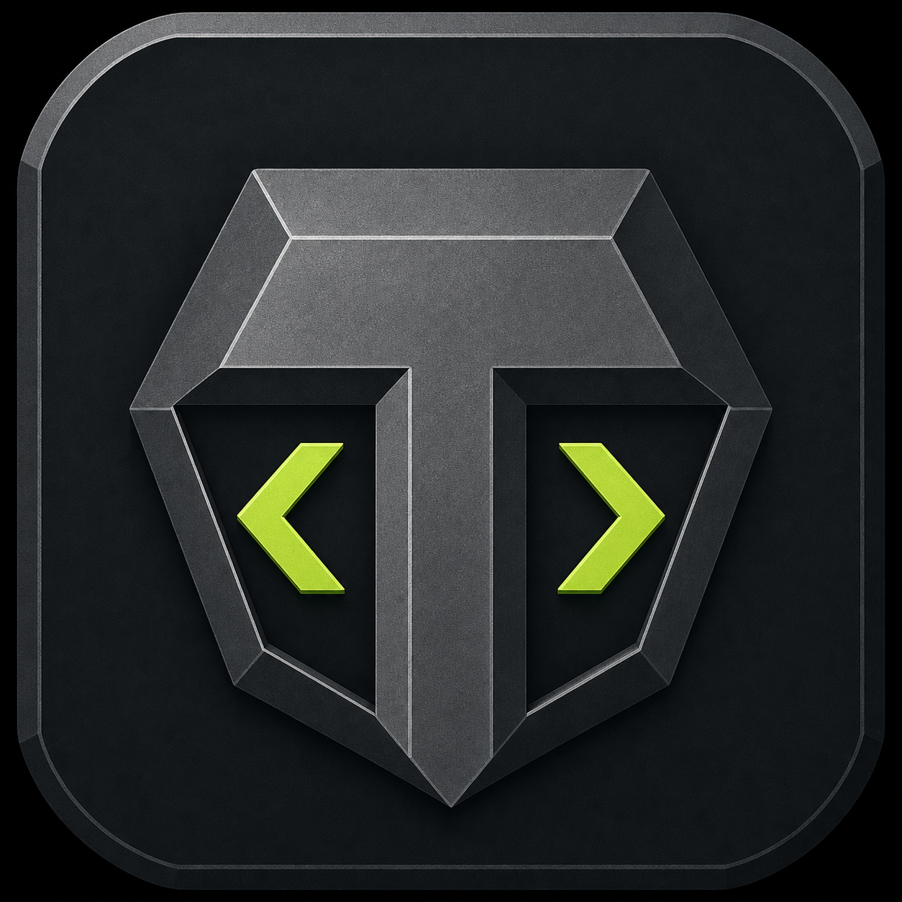

# Tungsten IDE

A rugged, cross-platform development environment built with Electron, React, and Monaco. Tungsten runs as a native desktop application on Windows, macOS, and Linux while retaining a browser workspace for development and demonstrations.



## Features

### Editing

- Monaco editor bundled locally for offline language services and syntax highlighting
- Multi-file tabs, minimap, bracket guides, sticky scope scrolling, visible whitespace, word wrap, and autosave
- Built-in formatting, quick file navigation, workspace search, symbols outline, command palette, and keyboard shortcuts
- Side-by-side live preview for HTML, CSS, and JavaScript projects
- Create, rename, delete, reveal, and refresh files from the explorer

### Desktop workspace

- Open real folders and restore the most recently used workspace on launch
- Safely read and write local files through a narrow Electron preload bridge
- Run real project commands in the selected workspace
- Refresh files changed by other applications without restarting Tungsten
- Native Git status, branch information, changed-file list, staging, and commits

### Language support

Tungsten recognizes and highlights more than 40 languages and formats, including:

- JavaScript, TypeScript, Python, Rust, Go, Java, C, C++, and C#
- PHP, Ruby, Kotlin, Swift, Dart, Lua, Shell, PowerShell, and SQL
- HTML, CSS, Sass, Less, JSON, YAML, XML, Markdown, and GraphQL
- Dockerfile, Terraform/HCL, Elixir, F#, Scala, R, Perl, Julia, and Solidity
- Clojure, Pascal, Objective-C, Handlebars, Vue, Svelte, and more

Language-specific compilers, formatters, and runtime tools can be called through the native terminal when installed on the computer.

### Security

- Electron renderer sandbox and context isolation
- Node integration disabled in the renderer
- Path traversal and symbolic-link write protection
- Size and file-count limits for workspace indexing
- Sandboxed live-preview iframe
- Minimal, typed IPC surface

## Run the desktop app

```bash
npm install
npm run desktop:dev
```

The desktop development command launches Vite and Electron together. A graphical desktop session is required.

## Build installers

```bash
npm run desktop:dist
```

Installers are written to `out/`:

- **Windows:** NSIS installer and portable executable
- **macOS:** DMG and ZIP
- **Linux:** AppImage and Debian package

Installers should be built on their target operating system. The included [GitHub Actions workflow](.github/workflows/desktop-build.yml) builds all platforms from a manually triggered workflow or version tag.

For an unpacked build on the current platform:

```bash
npm run desktop:pack
```

## Browser development

```bash
npm run dev
```

The Vite server binds to `0.0.0.0` for hosted development environments. Native filesystem, Git, and process access remain available only inside the desktop application.

## Quality checks

```bash
npm run build
npm run lint
npm audit
```
